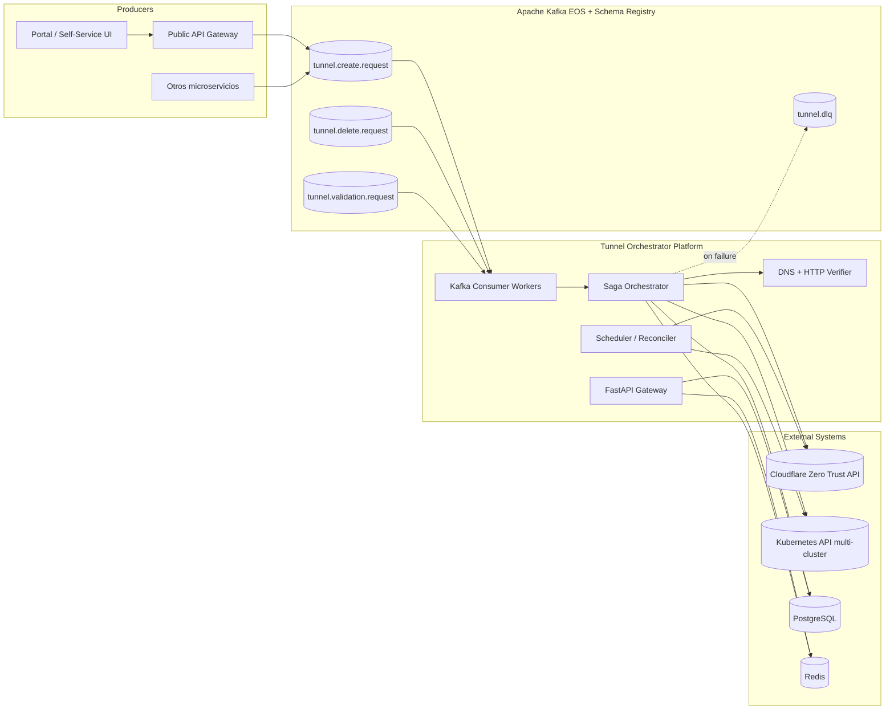
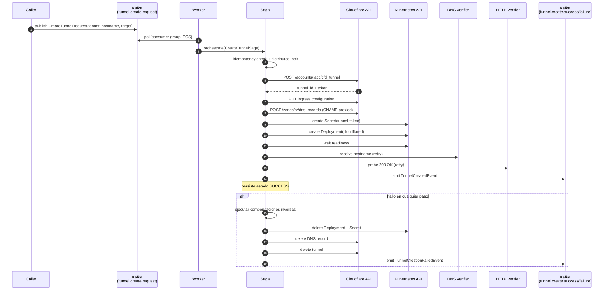

# Tunnel Orchestrator Platform

> **Plataforma distribuida para la creación, validación, despliegue y destrucción dinámica de túneles Cloudflare (cloudflared) de forma programática y orientada a eventos.**

[](https://www.python.org/downloads/)
[](https://fastapi.tiangolo.com/)
[](https://kafka.apache.org/)
[](https://www.cloudflare.com/zero-trust/)
[](https://kubernetes.io/)
[](LICENSE)

---

## Tabla de contenidos

1. [Visión general](#visión-general)
2. [Arquitectura](#arquitectura)
3. [Stack tecnológico](#stack-tecnológico)
4. [Estructura del repositorio](#estructura-del-repositorio)
5. [Inicio rápido (local)](#inicio-rápido-local)
6. [Workflow de creación de túneles](#workflow-de-creación-de-túneles)
7. [Topics Kafka](#topics-kafka)
8. [Despliegue en Kubernetes](#despliegue-en-kubernetes)
9. [Observabilidad](#observabilidad)
10. [Seguridad y Zero Trust](#seguridad-y-zero-trust)
11. [Multi-tenant](#multi-tenant)
12. [Resiliencia y escalabilidad](#resiliencia-y-escalabilidad)
13. [Documentación adicional](#documentación-adicional)

---

## Visión general

**Tunnel Orchestrator** es un microservicio distribuido, **async-first**, **event-driven** y **cloud-native** que automatiza el ciclo de vida completo de túneles Cloudflare *remotely-managed*. Los consumidores publican eventos en Apache Kafka y el sistema ejecuta de forma idempotente — con semántica *exactly-once* y *Saga compensatorias* — todo el flujo necesario para exponer un servicio interno a Internet a través de Cloudflare Zero Trust:

1. Crea el túnel mediante la API de Cloudflare.
2. Recupera el token *remotely-managed*.
3. Configura las *ingress rules*.
4. Crea el registro DNS CNAME *proxied*.
5. Crea el `Secret` y el `Deployment` independiente de `cloudflared` en Kubernetes.
6. Verifica propagación DNS y disponibilidad HTTP.
7. Emite eventos de éxito o fallo y persiste el estado de la transacción.

En caso de fallo en cualquier paso, el **Saga Orchestrator** ejecuta las transacciones compensatorias en orden inverso para dejar el sistema en un estado consistente.

> Diseñado para operar en producción bajo **alta carga**, **multi-tenant**, **multi-cluster** y **multi-región**.

---

## Arquitectura

La plataforma sigue **Domain-Driven Design**, **Clean Architecture** y **Hexagonal Architecture**, con separación estricta entre dominio, aplicación e infraestructura. La capa de aplicación se organiza en torno a **CQRS + Saga Pattern** y consume eventos a través de un **Transactional Outbox** sobre Apache Kafka.



> Diagramas C4 detallados, secuencia y flujos de compensación en [`docs/architecture/diagrams/`](docs/architecture/diagrams/).

---

## Stack tecnológico

| Capa | Tecnología |
|---|---|
| Lenguaje | **Python 3.12+** (async-first) |
| Web framework | **FastAPI** + **Pydantic v2** |
| Mensajería | **Apache Kafka** + **aiokafka** + **Confluent Schema Registry** (Avro) |
| Cloudflare | **`cloudflare` Python SDK v5 (Async)** |
| Kubernetes | **`kubernetes_asyncio`** |
| Persistencia | **PostgreSQL 15+** + **SQLAlchemy 2.0 async** + **Alembic** |
| Cache / Locks | **Redis 7+** (Redlock) |
| Observabilidad | **OpenTelemetry** → **SigNoz** + Prometheus + Grafana + Loki |
| Despliegue | **Docker** + **Helm** + **ArgoCD** + **GitHub Actions** |
| IaC | **Terraform** (cuentas Cloudflare, DNS zone bootstrap) |
| Testing | **pytest-asyncio** + **testcontainers** + **Locust** |

---

## Estructura del repositorio

```
.
├── apps/                          # Procesos ejecutables (entrypoints)
│   ├── api/                       # FastAPI Gateway
│   ├── worker/                    # Kafka consumers
│   ├── scheduler/                 # Reconciliación periódica
│   └── dlq_processor/             # Procesador de Dead Letter Queue
│
├── services/
│   └── tunnel_orchestrator/
│       ├── domain/                # DDD: agregados, eventos, value objects, puertos
│       ├── application/           # CQRS, Sagas, Use Cases, ports
│       └── infrastructure/        # Adapters (Cloudflare, K8s, Kafka, PG, Redis)
│
├── shared/                        # Shared kernel (logging, OTel, errores, config)
├── platform/                      # Event envelopes, Avro schemas, versioning
│
├── deployments/
│   ├── docker/                    # Dockerfiles multi-stage por proceso
│   ├── kubernetes/                # Manifests Kustomize base + overlays
│   ├── argocd/                    # GitOps ArgoCD Application
│   └── terraform/                 # Módulos Terraform Cloudflare
│
├── charts/
│   └── tunnel-orchestrator/       # Helm chart parametrizable
│
├── docs/                          # Documentación técnica (English)
│   ├── ARCHITECTURE.md
│   ├── architecture/              # ADRs, diagramas Mermaid
│   ├── kafka-contracts/           # Contratos de eventos por topic
│   ├── operations/                # Runbooks, scaling, DR, troubleshooting
│   └── development/               # Local setup, testing, contributing
│
├── migrations/                    # Alembic migrations
├── scripts/                       # Bootstrap, create topics, seed
├── tests/                         # unit, integration, contract, load, chaos
│
├── .devcontainer/                 # Dev environment reproducible
├── .github/workflows/             # CI/CD pipelines
├── docker-compose.yml             # Stack local (Kafka, PG, Redis, SigNoz)
├── pyproject.toml
├── Makefile
└── README.md
```

---

## Inicio rápido (local)

### Prerrequisitos

- Docker 24+ y Docker Compose v2.
- Python 3.12+ y [uv](https://docs.astral.sh/uv/) (recomendado) o pip.
- Make.

### Bootstrap

```bash
# Clonar e instalar dependencias
make install

# Levantar el stack de dependencias (Kafka, PostgreSQL, Redis, SigNoz)
make up

# Crear los topics Kafka y aplicar migraciones
make bootstrap

# Levantar la API y los workers en modo dev
make run-api      # http://localhost:8000  (Swagger en /docs)
make run-worker   # consumer process
```

### Verificación rápida

```bash
# Smoke test E2E (requiere CLOUDFLARE_API_TOKEN en .env)
make smoke

# Tests
make test           # unit
make test-integration
make test-contract
```

> Variables de entorno completas en [`.env.example`](.env.example).
> Guía detallada de setup local en [`docs/development/local-setup.md`](docs/development/local-setup.md).

---

## Workflow de creación de túneles



Detalle de cada step en [`docs/architecture/03-saga-orchestration.md`](docs/architecture/03-saga-orchestration.md).

---

## Topics Kafka

| Topic | Producido por | Consumido por | Particionado por | Retención |
|---|---|---|---|---|
| `tunnel.create.request` | clientes externos | `worker` | `tenant_id` | 7d |
| `tunnel.create.processing` | `saga` | observability | `tunnel_id` | 1d |
| `tunnel.create.success` | `saga` | downstream | `tunnel_id` | 30d |
| `tunnel.create.failure` | `saga` | alerting | `tunnel_id` | 30d |
| `tunnel.delete.request` | clientes externos | `worker` | `tenant_id` | 7d |
| `tunnel.delete.success` | `saga` | downstream | `tunnel_id` | 30d |
| `tunnel.delete.failure` | `saga` | alerting | `tunnel_id` | 30d |
| `tunnel.validation.request` | `scheduler` | `worker` | `tenant_id` | 1d |
| `tunnel.validation.success` | `saga` | observability | `tunnel_id` | 7d |
| `tunnel.validation.failure` | `saga` | alerting | `tunnel_id` | 30d |
| `tunnel.dlq` | `worker` (on poison) | `dlq_processor` | `tenant_id` | 90d |

Contratos de eventos versionados en [`docs/kafka-contracts/`](docs/kafka-contracts/) y schemas Avro en [`platform/schemas/`](platform/schemas/).

---

## Despliegue en Kubernetes

```bash
# Render local del chart
helm template tunnel-orchestrator charts/tunnel-orchestrator -f charts/tunnel-orchestrator/values.dev.yaml

# Despliegue dev
helm upgrade --install tunnel-orchestrator charts/tunnel-orchestrator \
  -n tunnel-orchestrator --create-namespace \
  -f charts/tunnel-orchestrator/values.dev.yaml

# Producción vía ArgoCD
kubectl apply -f deployments/argocd/application.yaml
```

Componentes desplegados:

- `tunnel-orchestrator-api` — FastAPI gateway (HPA por CPU + RPS).
- `tunnel-orchestrator-worker` — pool de consumers Kafka (HPA por consumer lag).
- `tunnel-orchestrator-scheduler` — reconciliación periódica.
- `tunnel-orchestrator-dlq` — reprocesador DLQ.
- `ServiceAccount` con `Role` mínimo para crear `Secret` y `Deployment` de `cloudflared` en namespaces de tenant.
- `NetworkPolicy` que restringe egress a Cloudflare API, Kafka, PostgreSQL y Redis.

> Cada `cloudflared` se despliega como **Deployment independiente** en el namespace del tenant — **nunca como sidecar**.

---

## Observabilidad

- **Tracing distribuido** vía OpenTelemetry: cada evento Kafka propaga `traceparent`, `correlation_id` y `causation_id`.
- **Métricas Prometheus**: latencia por step de saga, tasa de éxito, lag de consumer, llamadas a Cloudflare por tenant, *rate limit* hits.
- **Logs estructurados JSON** con `tenant_id`, `tunnel_id`, `correlation_id` en cada línea.
- **SigNoz** como backend OTLP unificado (traces + metrics + logs).
- **Dashboards Grafana** versionados en [`docs/operations/observability.md`](docs/operations/observability.md).

---

## Seguridad y Zero Trust

- API tokens **account-owned** y **rotables** con scope mínimo (Tunnel:Edit + DNS:Edit por zona).
- Secrets gestionados como `Secret` de Kubernetes — soporte Vault vía CSI driver (hooks listos).
- Autenticación API con **JWT** + **RBAC** por tenant.
- mTLS-ready entre componentes internos.
- `NetworkPolicy` por defecto deny + allow-list.
- Rotación automática programada de tokens vía scheduler (ver [`docs/operations/security.md`](docs/operations/security.md)).

---

## Multi-tenant

Cada tenant aísla:

| Recurso | Aislamiento |
|---|---|
| Cloudflare account | `account_id` propio + API token propio |
| Kubernetes namespace | namespace dedicado con quota |
| PostgreSQL | `tenant_id` en cada fila + RLS opcional |
| Kafka | particionado por `tenant_id` (orden garantizado por tenant) |
| Redis | namespace de claves `tenant:{id}:*` |

Modelo detallado en [`docs/architecture/04-multi-tenant.md`](docs/architecture/04-multi-tenant.md).

---

## Resiliencia y escalabilidad

- **Exactly-once semantics** vía Kafka transactional producer + idempotency table en PG.
- **Transactional Outbox** para evitar dual-write entre PG y Kafka.
- **Sagas compensatorias** garantizan consistencia eventual.
- **Retry exponencial con jitter** + **Circuit Breaker** por dependencia externa.
- **Rate limiter** local por API token de Cloudflare para no superar 1200 req/5min.
- **Distributed locks** (Redlock) por `(tenant_id, hostname)`.
- **HPA** por CPU + lag de consumer Kafka.
- **Graceful shutdown** con drenado de mensajes en vuelo.
- **Leader election** para procesos singleton (scheduler).

---

## Documentación adicional

- **Arquitectura**: [`docs/ARCHITECTURE.md`](docs/ARCHITECTURE.md)
- **Event-Driven**: [`docs/architecture/02-event-driven.md`](docs/architecture/02-event-driven.md)
- **Saga Orchestration**: [`docs/architecture/03-saga-orchestration.md`](docs/architecture/03-saga-orchestration.md)
- **Multi-tenant**: [`docs/architecture/04-multi-tenant.md`](docs/architecture/04-multi-tenant.md)
- **Zero Trust**: [`docs/architecture/05-zero-trust.md`](docs/architecture/05-zero-trust.md)
- **Runbook on-call**: [`docs/operations/runbook-oncall.md`](docs/operations/runbook-oncall.md)
- **Scaling guide**: [`docs/operations/scaling.md`](docs/operations/scaling.md)
- **Disaster Recovery**: [`docs/operations/disaster-recovery.md`](docs/operations/disaster-recovery.md)
- **Troubleshooting**: [`docs/operations/troubleshooting.md`](docs/operations/troubleshooting.md)
- **Local dev**: [`docs/development/local-setup.md`](docs/development/local-setup.md)
- **Testing**: [`docs/development/testing.md`](docs/development/testing.md)
- **Kafka contracts**: [`docs/kafka-contracts/README.md`](docs/kafka-contracts/README.md)

---

## Licencia

Apache License 2.0 — ver [LICENSE](LICENSE).
