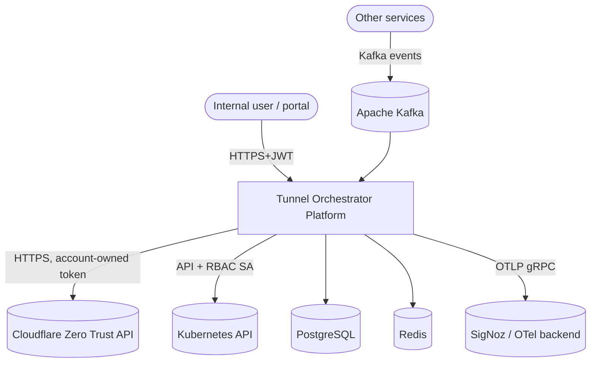
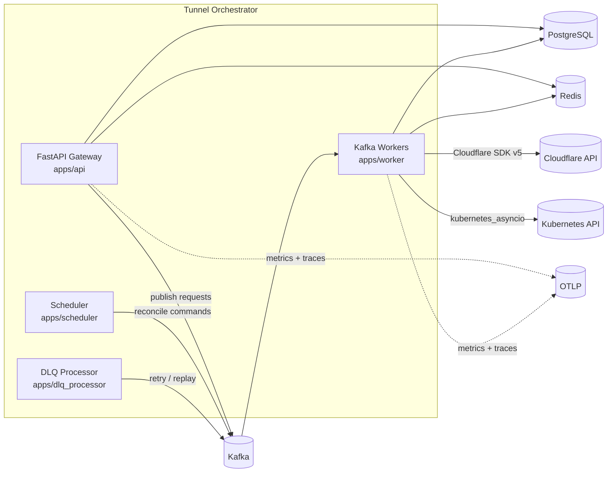
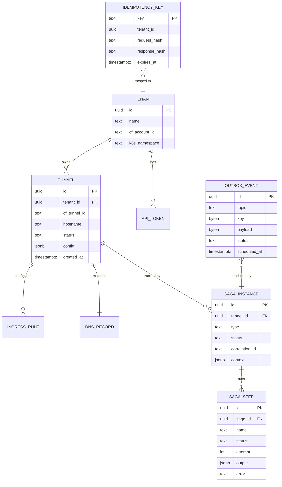

# Architecture — Tunnel Orchestrator Platform

> Living architecture document. ADR-driven (see `docs/architecture/adr/`). All diagrams are Mermaid and rendered in GitHub.

## 1. Goals & non-goals

### Goals
- Provide an **idempotent, async-first, event-driven** API to lifecycle Cloudflare Tunnels at scale.
- Decouple producers (UI, other services) from the orchestration runtime via Apache Kafka.
- Provide **exactly-once** end-to-end semantics for state-changing flows.
- Run `cloudflared` as **independent Kubernetes Deployments** (never as a sidecar).
- Be **multi-tenant** at the Cloudflare account + Kubernetes namespace level.
- Be horizontally scalable, observable and resilient under partial failures.

### Non-goals
- Not a general-purpose Kubernetes operator (we don't ship a CRD).
- Not a Cloudflare API proxy. We *adapt* a curated subset for tunnel orchestration.
- No locally-managed tunnel YAML. Configuration is **always** owned by Cloudflare.

## 2. Architectural styles applied

| Style | Where it shows up |
|---|---|
| **Domain-Driven Design** | `services/tunnel_orchestrator/domain/` — aggregates, value objects, domain events |
| **Hexagonal / Ports & Adapters** | `application/ports/*.py` define ports; `infrastructure/**` are the adapters |
| **Clean Architecture** | Strict dependency rule: `domain ← application ← infrastructure ← apps` |
| **CQRS** | `application/commands` vs `application/queries`; commands return events, queries return DTOs |
| **Saga Pattern** | `application/sagas/` orchestrates multi-step distributed transactions with explicit compensations |
| **Event Sourcing (light)** | All state changes emit immutable events; `tunnel.saga.state` (compacted) is the canonical projection |
| **Transactional Outbox** | DB and Kafka publish in a single atomic step via the `outbox` table |
| **Idempotent Receiver** | Every consumer dedupes via `(topic, partition, offset, message_key)` + business idempotency key |
| **Twelve-Factor** | Config from env, stateless processes, port binding, structured logs, disposability |

## 3. C4 — Context



## 4. C4 — Container



## 5. Module dependency rule

```
apps/         depends on  →  application + shared
application/  depends on  →  domain + shared (only ports it owns)
infrastructure/ depends on →  application ports + domain + shared
domain/       depends on  →  shared (only)
shared/       depends on  →  stdlib (only)
```

Enforced via `import-linter` rules (see `.importlinter`) and module-level smoke tests.

## 6. Threading & concurrency model

- Single event loop per process (`uvloop` enforced).
- Workers use **bounded concurrency**: `asyncio.Semaphore(WORKER_CONCURRENCY)` per partition.
- All blocking calls go through `anyio.to_thread.run_sync(...)`.
- Graceful shutdown sequence:
  1. `SIGTERM` received.
  2. Stop polling new Kafka messages (`consumer.unsubscribe()`).
  3. Drain in-flight sagas with timeout = `SAGA_GLOBAL_TIMEOUT_SECONDS`.
  4. Commit offsets, flush producer, close DB pool, close Redis.
  5. Exit 0.

## 7. Data model (logical)



## 8. Why **remotely-managed** tunnels?

| Concern | Locally-managed | **Remotely-managed (chosen)** |
|---|---|---|
| Config source of truth | YAML in ConfigMap | **Cloudflare account** (single source) |
| Multi-tenant config drift | High risk | None — provider owns it |
| Token rotation | Manual ConfigMap edit | **API call**; no Pod restart needed for ingress changes |
| Audit | Git history of YAML | **Cloudflare audit log** (account-scoped) |
| Operator complexity | More moving parts | `cloudflared` only needs the token |
| Spec compliance | ❌ contradicts requirements | ✅ matches `CLOUDFLARE_TUNNEL_CONFIG_SRC=cloudflare` |

See ADR-002 in `docs/architecture/adr/`.

## 9. Cross-cutting concerns

- **Observability**: every saga step has a span; every Kafka message carries `traceparent`, `tracestate`, `correlation-id`, `causation-id`, `tenant-id`, `idempotency-key` headers. Propagation handled by `shared/observability/`.
- **Security**: ADR-003 covers token isolation, RBAC, mTLS-readiness, secret rotation hooks.
- **Schema evolution**: Avro with `BACKWARD` compatibility on Schema Registry. Pydantic models are the runtime contract; Avro is the wire/at-rest contract.

## 10. Further reading

- `architecture/01-overview.md` — high-level narrative
- `architecture/02-event-driven.md` — topic taxonomy, message contracts
- `architecture/03-saga-orchestration.md` — saga state machine and compensations
- `architecture/04-multi-tenant.md` — tenant model & isolation guarantees
- `architecture/05-zero-trust.md` — Cloudflare Zero Trust integration model
- `architecture/adr/` — Architectural Decision Records
