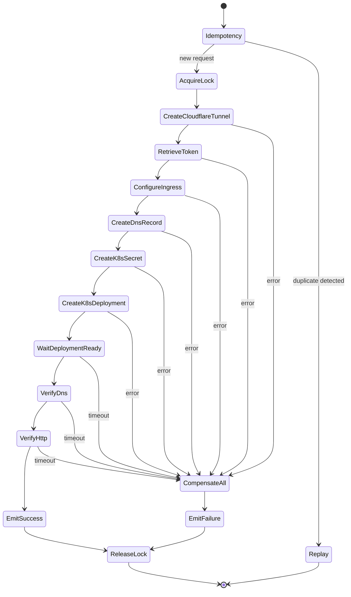

# Saga Orchestration

## Overview

The orchestrator implements an **orchestration-style saga** (not choreography) for every distributed write flow that touches more than one external system. Each saga is a finite state machine with explicit forward steps and explicit compensating steps that run in **reverse order** when any forward step fails.

## State machine — `CreateTunnelSaga`

## Step inventory

| # | Step | Forward action | Compensating action |
|---|---|---|---|
| 1 | `Idempotency` | Look up `idempotency_key` in PG | — |
| 2 | `AcquireLock` | Redlock on `(tenant_id, hostname)` | release lock |
| 3 | `CreateCloudflareTunnel` | `POST /accounts/:acc/cfd_tunnel` (config_src=cloudflare) | `DELETE /accounts/:acc/cfd_tunnel/:id` |
| 4 | `RetrieveToken` | `GET /accounts/:acc/cfd_tunnel/:id/token` | — (no side effect) |
| 5 | `ConfigureIngress` | `PUT /accounts/:acc/cfd_tunnel/:id/configurations` | reset ingress to empty + 404 catch-all |
| 6 | `CreateDnsRecord` | `POST /zones/:zone/dns_records` (CNAME, proxied) | `DELETE /zones/:zone/dns_records/:rid` |
| 7 | `CreateK8sSecret` | `Secret(tunnel-token-{tunnel_id})` | `delete Secret` |
| 8 | `CreateK8sDeployment` | independent `Deployment(cloudflared)` | `delete Deployment` |
| 9 | `WaitDeploymentReady` | poll Deployment.status (timeout) | — (deployment already created) |
| 10 | `VerifyDns` | `dnspython` resolve hostname → 1.1.1.1 / 8.8.8.8 | — |
| 11 | `VerifyHttp` | `httpx.get(https://hostname)` expect 2xx/3xx | — |
| 12 | `EmitSuccess` | publish `tunnel.create.success` via outbox | — |
| 13 | `ReleaseLock` | release Redlock | — |

## Compensation guarantees

- **Idempotent compensations**: each compensating action treats `404 Not Found` as success (resource already gone).
- **Reverse order**: if `CreateK8sSecret` fails after `CreateDnsRecord` succeeded, compensations run in order: `delete DNS` → `reset ingress` → `delete tunnel`.
- **Persisted state**: every transition writes to `saga_step` rows so a worker that crashes mid-saga can be resumed by another worker (recovery handler picks up `status='IN_PROGRESS'` and `worker_id` lock has expired).
- **Bounded retries within a step**: each step retries with exponential backoff + jitter up to `RETRY_MAX_ATTEMPTS`. After exhaustion the saga transitions to `CompensateAll`.

## Outbox pattern

Sagas never call `kafka.send()` directly. Instead:

1. Inside the same DB transaction that mutates `tunnel`/`saga_step`, the saga inserts a row into `outbox_event(topic, key, payload, status='PENDING')`.
2. A background `OutboxRelay` task selects `PENDING` rows in batches, sends to Kafka via the **transactional producer**, and on commit marks them `SENT`.
3. Schema Registry validation happens **before** insert (schema fetch is cached).

This guarantees: *if the DB transaction commits, the event will eventually be published exactly once.*

## Recovery & exactly-once

- Kafka consumers are configured with `enable.auto.commit=false` and `isolation.level=read_committed`.
- Producer uses `enable.idempotence=true`, `acks=all`, and a **stable** `transactional.id = ${pod_name}-${partition_assignment_hash}` to allow zombie fencing.
- The handler pattern is: `consume → begin_tx → write_outbox → commit_offset_in_tx → commit_tx`. Offsets and outbox writes are part of the same Kafka transaction.

## Failure taxonomy

| Class | Examples | Retried? | Compensated? |
|---|---|---|---|
| Transient | 5xx, network timeout, Redis unavailable | Yes (within step) | Only if exhausted |
| Rate limit | Cloudflare 429 | Yes (with `Retry-After`) | No |
| Conflict | Tunnel already exists for hostname | No | Returned to caller; no compensation |
| Fatal | 401/403, malformed token | No | Yes |
| Poison message | Avro decode error, schema mismatch | No | Routed to `tunnel.dlq` with full envelope |

## Observability hooks

Each saga step:

- Opens a span: `saga.{name}.{step}` with attributes `saga_id`, `tenant_id`, `tunnel_id`, `attempt`, `step_index`.
- Emits the metric `saga_step_duration_seconds{step,outcome}`.
- Logs structured JSON with `event="saga.step.completed"` and `step`, `outcome`, `latency_ms`.
- DLQ messages carry the full original envelope plus `dlq_reason`, `dlq_stack`, `dlq_first_seen_at`.
