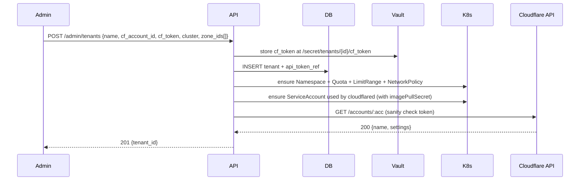

# Multi-tenant Model

## Tenant unit

A **tenant** is the smallest unit of isolation. One tenant maps to:

| Layer | Resource |
|---|---|
| Cloudflare | Dedicated `account_id` + dedicated API token (account-owned, scoped) |
| Kubernetes | Dedicated namespace `tunnels-{tenant_slug}` with `ResourceQuota` and `LimitRange` |
| PostgreSQL | `tenant_id` column on every multi-tenant table + optional Row-Level Security policies |
| Kafka | Partitioned by `tenant_id` (preserves order per tenant) |
| Redis | Key namespace `tenant:{tenant_id}:*` |
| Observability | Resource attribute `tenant.id` on every span/metric/log |

## Tenant onboarding



## Token storage

- API tokens are **never** stored in PG. PG keeps only a *reference* (`vault_path`).
- Loaded on demand into a per-process LRU cache (`maxsize=128`, TTL 5 min).
- Rotated by the scheduler via `tunnel.token.rotate.request` once a quarter or on demand.
- Worker holds the token **only** for the duration of a saga; never logged.

## Cloudflare provider per tenant

The `CloudflareProvider` is instantiated **per tenant** behind a registry:

```python
provider = await cloudflare_registry.get(tenant_id)
await provider.create_tunnel(...)
```

Each provider has its own `aiolimiter.AsyncLimiter(1200, 300)` so one noisy tenant cannot exhaust another's quota. The registry is global per worker process and uses a TTL cache.

## Kubernetes provider per tenant

`KubernetesProvider` is also tenant-aware:

- Resolves the right kubeconfig from `K8S_MULTI_CLUSTER_CONFIG` for tenants in different clusters.
- Always namespaces operations to the tenant namespace.
- Uses a single `ServiceAccount` per cluster (`tunnel-orchestrator`) with a `Role` allowing only `secrets:create,delete` and `deployments:*` in the tenant namespace.

## Quotas (defaults, overridable per tenant)

- Max 200 active tunnels per tenant (configurable).
- Max 50 in-flight saga instances per tenant (Redis counter).
- Cloudflare API rate: 1200 req / 5 min per token.
- DNS verification: 60 in-flight per tenant.

## Noisy-neighbour protection

- Per-tenant `aiolimiter` for Cloudflare API.
- Per-tenant `Semaphore` for active sagas.
- Kafka partitioning by `tenant_id` means a slow tenant slows only its partition; other partitions continue uninterrupted.
- Consumer assignor: `cooperative-sticky` keeps tenant→partition assignment stable across rebalances.

## Cross-tenant guardrails

- Idempotency keys are namespaced: `tenant:{id}:hostname:{h}` — collisions across tenants impossible.
- All DB queries go through `repository.with_tenant(tenant_id)` which injects the predicate; bare queries are forbidden by an `import-linter` rule.
- Audit log includes `tenant_id` on every entry; cross-tenant reads/writes raise `CrossTenantAccessDenied`.

## Single-cluster vs multi-cluster

- Default: tunnels for all tenants run in the same cluster, separated by namespace.
- Multi-cluster: configure `tenant.cluster_id` and `K8S_MULTI_CLUSTER_CONFIG`. The orchestrator picks the right kubeconfig and proceeds identically.
