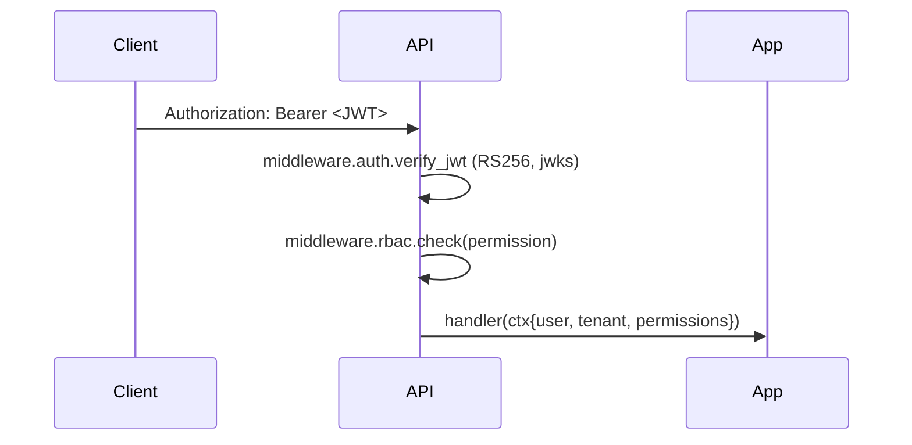

# Zero Trust integration model

## Principles

- **Never trust, always verify**: every request to the API is authenticated (JWT) and authorised (RBAC). Every saga step verifies the resource belongs to the tenant before acting.
- **Least privilege**: API tokens scoped to `Cloudflare Tunnel:Edit` + `DNS:Edit` for specific zones only. Kubernetes `ServiceAccount` granted only the verbs needed.
- **Short-lived credentials**: JWTs ≤ 15 min, refreshed via OIDC. Cloudflare tokens rotated quarterly via scheduled saga.
- **Encryption everywhere**: TLS in transit (mTLS-ready between internal services), Kubernetes Secrets backed by KMS provider, Postgres at-rest via cloud provider.

## API authentication & authorization



- JWTs signed with **RS256**; public key fetched via JWKS URL (cached 10 min).
- Required claims: `sub`, `tenant_id`, `permissions[]`, `exp`, `iat`, `iss`, `aud`.
- Permissions follow `<resource>:<action>` syntax: `tunnel:create`, `tunnel:delete`, `tunnel:read`, `tenant:admin`.
- RBAC matrix in `services/.../infrastructure/auth/rbac.py`.

## Cloudflare token model

| Token type | Used for | Storage |
|---|---|---|
| Per-tenant **account-owned** API token | Tunnel CRUD, DNS CRUD on listed zones | Vault (`/secret/tenants/{id}/cf_token`) |
| Per-tunnel **remote-managed token** | Authenticates `cloudflared` to Cloudflare control plane | Kubernetes `Secret` in tenant namespace |

Account-owned tokens **never** leave the orchestrator process memory. The remote-managed tunnel token reaches `cloudflared` via Kubernetes `Secret` mounted as env var — and is also rotatable via API.

## Kubernetes RBAC (per cluster)

```yaml
apiVersion: rbac.authorization.k8s.io/v1
kind: ClusterRole
metadata: { name: tunnel-orchestrator }
rules:
  - apiGroups: [""]
    resources: ["secrets", "configmaps"]
    verbs: ["get", "list", "create", "update", "patch", "delete"]
  - apiGroups: ["apps"]
    resources: ["deployments", "deployments/scale", "deployments/status"]
    verbs: ["get", "list", "watch", "create", "update", "patch", "delete"]
  - apiGroups: [""]
    resources: ["namespaces"]
    verbs: ["get", "list"]
  - apiGroups: [""]
    resources: ["events"]
    verbs: ["create"]
```

Bound only inside tenant namespaces via `RoleBinding` — no cluster-wide write power.

## Network policies

Default deny + allow list:

- **API pod**: ingress from `ingress-nginx`; egress to PG, Redis, Kafka, OTel collector, Cloudflare API.
- **Worker pod**: no ingress (except metrics scrape from Prom); egress to PG, Redis, Kafka, Cloudflare API, K8s API.
- **`cloudflared` pods (per tenant)**: no ingress; egress only to `*.cloudflare.com:7844` and DNS.

## Vault integration hooks

- Secret CSI driver mounts Vault paths into the orchestrator pod at `/vault/secrets/...`.
- Optional `--vault-mode` flag swaps the in-process token cache for a Vault-backed reader.
- Token rotation event triggers Vault `kv/data/tenants/{id}/cf_token` update + Cloudflare API token rotation in the same saga.

## Audit trail

- Every state-changing API call → row in `audit_log` + event on `tunnel.audit`.
- Every saga step transition → row in `saga_step` + event on `tunnel.audit`.
- Audit log fields: `actor`, `tenant_id`, `action`, `resource`, `before`, `after`, `outcome`, `correlation_id`, `ip`, `user_agent`, `ts`.

## Compliance hooks

- PII free by design (we only handle hostnames + tunnel ids).
- Logs go through a redactor (`shared/logging/redactor.py`) that removes any field matching `*token*`, `*secret*`, `*password*` before serialisation.
